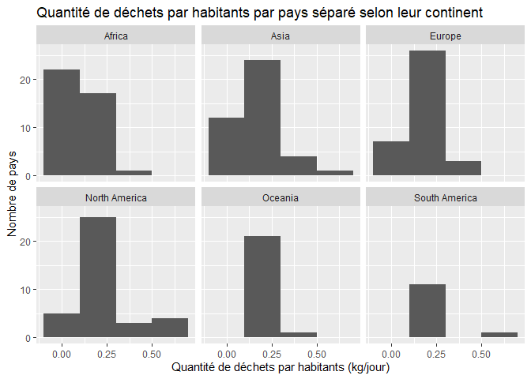

Lab 02 - Plastic waste
================
Élisabeth Trifiro
22 septembre 2025

## Chargement des packages et des données

``` r
library(tidyverse) 
```

``` r
plastic_waste <- read_csv("data/plastic-waste.csv")
```

Commençons par filtrer les données pour retirer le point représenté par
Trinité et Tobago (TTO) qui est un outlier.

``` r
plastic_waste <- plastic_waste %>%
  filter(plastic_waste_per_cap < 3.5)
```

## Exercices

### Exercise 1

``` r
plastic_waste <- plastic_waste %>%
  filter(plastic_waste_per_cap <3.5)
ggplot(plastic_waste,aes(x=plastic_waste_per_cap))+
  geom_histogram(binwidth=0.21)+
  facet_wrap(~continent,ncol=3)+
  labs(title="Quantité de déchets par habitants par pays séparé selon leur continent", x="Quantité de déchets par habitants (kg/jour)", y="Nombre de pays")
```

<!-- --> Il
est possible d’observer que pour tous les continents excepté l’Afrique
ont plus de pays ayant environ 0.2 de gaspillage plastique par habitant
que de pays qui en ont presque 0. Cela signifie en bref qu’il y a
beaucoup moins de gaspillage par personne en Afrique que dans tous les
autres continents.

### Exercise 2

``` r
plastic_waste <- plastic_waste %>%
  filter(plastic_waste_per_cap<3.5)
ggplot(plastic_waste,aes(x=plastic_waste_per_cap,fill=continent,color=continent))+
  geom_density(alpha=0.5)+
  labs(title="Densité de pays par continent selon leur quantité de déchets par habitants", x="Quantité de déchets par habitants (kg/jour)", y="Densité")
```

<!-- -->

Le réglage de la couleur (color et fill) se trouve dans la parenthèse du
aes (aesthetics) puisque ces paramètres sont associés avec des variables
du jeu de données. En effet, chaque couleur est associée avec un
continent et si on en retire un, les couleurs vont changer. Au
contraire, le réglage de la transparence (alpha) ne se situe par dans
l’aesthetics puisque la transparence ne change pas avec une variable. Si
on retire un continent de la liste, il n’y a aucun effet sur la
transparence.

### Exercise 3

Boxplot:

``` r
plastic_waste <- plastic_waste %>% 
  filter(plastic_waste_per_cap<3.5)
ggplot(plastic_waste,aes(x=continent, y=plastic_waste_per_cap))+
  geom_boxplot()+
  labs(title="Distribution de la quantité de déchets par habitants selon le continent qu'ils habitent", x="Continent", y="Quantité de déchets par habitants (kg/jour)")
```

<!-- -->

Violin plot:

``` r
plastic_waste <- plastic_waste %>%
  filter(plastic_waste_per_cap<3.5)
ggplot(plastic_waste,aes(x=continent, y=plastic_waste_per_cap))+
  geom_violin()+
  labs(title="Distribution de la quantité de déchets par habitants selon le continents qu'ils habitent", x="Continent", y="Quantité de déchets par habitants (kg/jour)")
```

<!-- -->

Les violons, au contraire des boites, permettent de voir la distribution
à l’intérieur du 50% des données qui se situent dans la section blanche.

### Exercise 4

``` r
plastic_waste <- plastic_waste %>%
  filter(plastic_waste_per_cap<3.5)
ggplot(plastic_waste,aes(x=plastic_waste_per_cap, y=mismanaged_plastic_waste_per_cap, color=continent))+
  geom_point()+
  labs(title="Quantité de déchets non gérés par habitants selon la quantité de déchets par habitants", x="Quantité de déchets par habitants (kg/jour)", y="Quantité de déchets non gérés par habitants (kg/jour)", color ="Continent")
```

<!-- -->

Si on considère tous les continents, on peut voir qu’il n’y a aucun pays
qui se débarasse parfaitement de tous les déchets qu’il crée. En
observant chaques continents spécifiques, il est possible de voir que
les continents comme l’Afrique et l’Océanie se débarassent moins bien
des déchets qu’ils créent que d’autres continent comme l’Europe et
l’Amérique du Nord. L’Asie est un continent est un peu spécial puisque
la distribution des pays est très vairée. Il y a autant des pays qui se
débarassent assez bien de leurs déchets que de pays qui se débarassent
mal de leurs déchets.

### Exercise 5

``` r
plastic_waste <- plastic_waste %>%
  filter(plastic_waste_per_cap <3.5)
ggplot(plastic_waste,aes(x=plastic_waste_per_cap, y=total_pop))+
  geom_point()+
  labs(title="Population totale du pays selon sa quantité de déchets par habitants", x="Quantité de déchets par habitants (kg/jour)", y="Population total du pays")
```

    ## Warning: Removed 10 rows containing missing values or values outside the scale range
    ## (`geom_point()`).

<!-- -->

``` r
plastic_waste <-plastic_waste %>%
  filter(plastic_waste_per_cap <3.5)
ggplot(plastic_waste, aes(x=plastic_waste_per_cap, y=coastal_pop))+
  geom_point()+
  labs(title="Population côtière du pays selon sa quantité de déchets par habitants totaux", x="Quantité de déchets par habitants totaux (kg/jour)", y="Population côtière du pays")
```

<!-- -->

Lorsqu’on regarde les deux graphiques, on peut assumer que les pays aux
populations côtières ont moins de déchets par habitants que les pays
ayant moins de population côtières. On forme cette pensée à cause la
tendance verticale dans la partie inférieur de l’axe des x sur le
deuxième graphique; tendance que le premier graphique ne possède pas.
Malgré cette conclusion, il n’y a aucun des deux graphiques qui démontre
une relations plus forte entre les deux variables.

## Conclusion

Recréez la visualisation:

``` r
plastic_waste_coastal <- plastic_waste %>%
  mutate(coastal_pop_prop = coastal_pop/total_pop)%>%
  filter(plastic_waste_per_cap <3)
ggplot(plastic_waste_coastal, aes(x=(coastal_pop/total_pop), y=plastic_waste_per_cap))+
  geom_point(aes(colour=continent))+
  geom_smooth(colour="black")+
  labs(title= "Quantité de déchets plastiques vs Proportion de la population côtière", subtitle="Selon le continent", x= "Proportion de la population côtière (Coastal/total population)", y= "Nombre de déchets plastiques par habitants", Colour= "Contient")
```

    ## `geom_smooth()` using method = 'loess' and formula = 'y ~ x'

    ## Warning: Removed 10 rows containing non-finite outside the scale range
    ## (`stat_smooth()`).

    ## Warning: Removed 10 rows containing missing values or values outside the scale range
    ## (`geom_point()`).

<!-- --> En observant ce
graphique, il est possible de voir que les pays à faible population
côtière (moins de 0.5) ont souvent une quantité de déchets par habitant
moins élevé que la moyenne. Il est possible d’observer aussi que les
pays d’Afrique sont plus souvent situés en bas de la moyenne tandis que
les autres continents ont une plus grande dispertion. Finalement, on
peut voir que la droite représentant la moyenne est en croisance jusqu’à
une proportion de la population côtière d’environ 0.6. Par la suite, la
ligne est en faible décroisance.
